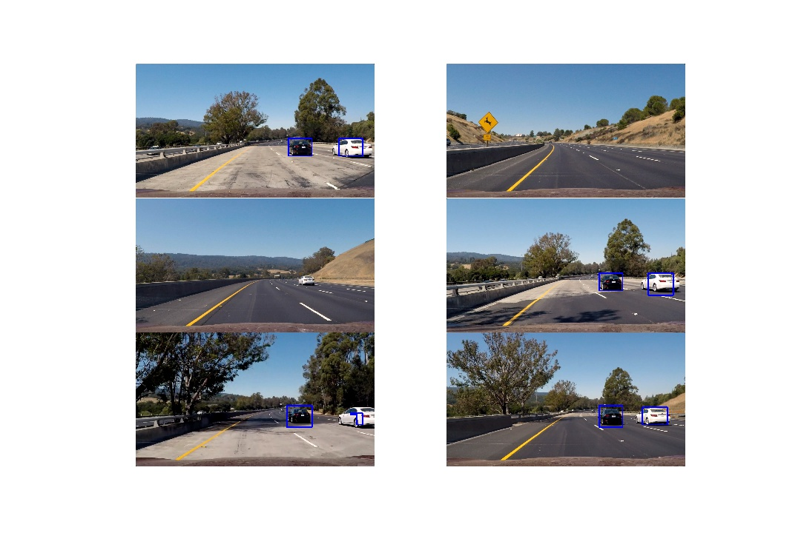

# Vehicle Detection
This is a writeup describing my solution to the vehicle detection project for the Udacity Self-Driving Car coursee.  The solution uses a Linear SVM classifier with a sliding window technique to detect vehicles in an image with translation invariance.  The ipython notebook containing the code can be found in [vehicle-detect.ipynb](vehicle-detect.ipynb).

## Feature Vector
 
In cell #3 of [vehicle-detect.ipynb](vehicle-detect.ipynb) I created the feature vector that would be later used by vehicle detection classifier.  The feature vector was created by first converting color channels from RGB to YCrCb, and then calculating three components (spatial color bin, histogram of color, and histogram of gradients).  The choice to use YCrCB over other color channels was due to it achieving the best performance against the training images when using the SVM classifier.

* A spatial color bin vector, which is a downsampled image 32x32 pixels where each color channel is converted to a 1D vector and appended together with the other two channels.

* A histogram of color channels, which is where we take each color channel separately and create a histogram (32 bins) of the color channel values.  The three resulting histograms are appended together to create one vector.

* A histogram of gradients (HOG) feature, which is calculated using 9 orientations, 8x8 pixel cells, and a 2x2 block for normalizing pixel values.  The HOG feature is calculated for each color channel in the image and then appended to create a single 1D vector.  The parameter values for the HOG feature creation was chose empirically based on the accuracy score of the classifier.

The three vectors above are then concatenated together to create one single feature vector (8460 features) used for classification.

## Classifier Training

Next I trained a Linear SVM classifier using the feature vector created above on a labeled training set of vehicle and non-vehicle images.  In cell #5, I perform the following steps.

* Create a feature vectors for all of the training images
* Normalize the feature vectors to be from -0.5 - 0.5
* Create a vector (y) to store the labels 0=non-car, 1=car

Then I train the classifier on the above data.  In order to avoid overfitting I reserve 20% of data for test validation during training.  I also shuffle the data during each epoch to avoid the data ording affecting the training.

With the feature vector described above and the Linear SVM, I was able to achieve accuracy of ~99.24% on the test set.

## Sliding Window

Next I defined a function that could create windows of multiple scales of the original 64x64 image (0.5, 0.75, 1.0, 1.25, 1.5, 2.0, 2.5, 3.0) and slide them over the image in an overlapping fashion.  These windows would later be used in the detection pipeline to detect vehicles of different scales and locations in the image.

The method scans the image, but i have limited the x and y ranges to scan to limit false positives outside of the area where vehicles are likely to be found (i.e. trees and roadside).  By limiting the scan ranges to where vehicles were likely to be found we also decreased the runtime of the detection pipeline.  

I ended up deciding to use eight scales to search for (0.5, 0.75, 1.0, 1.25, 1.5, 2.0, 2.5, 3.0).  I arrived at these values somewhat empirically.  I viewed the supplied test images and found what the scale of the vehicles in the image were.  These three scales were a good mix to capture vehicles in the near to middle range.  They were also large enough that the runtime wasn't serverely impacted due to the creation of many small windows.  The window sizes were also have the same aspect ratio as the original training images.

I also adjusted the overlapping percentages from the default (50%) to 66%.  This was in response to missing some detections of vehicles at a medium distance.  It seems the patch would slide too far between iterations and miss the vehicle.

# False Positive Reduction
In order to avoid false positives I added a method of combining multiple overlapping detections using a 'heatmap'.  The heatmap method counts the number of detections for a region of the image, and then applies a threshold function to filter out regions that have a number of detections less than the threshold.  Once the heatmap was thresholded, I used the scipy.ndimage.measurements.label function to create a bounding box to the remaining heatmap regions.

I also attempted to restrict the search space as much as possible to just the road.  I was seeing lots of false positives in the greenery on the side of the road.  I reduced the x range to be searched near the top of the field of view.

For the video, I also added a function to accumulate the heatmaps over a series of frames, add them together, and then apply the threshold.  This served to minimize the impact of spurious detections that lasted only a single frame.  It did this by prefering 'stable' regions that were detected over time. Since trees in the seen were moving so fast they failed to meet this criteria and were filtered out.

# Single Frame Examples
Here are some examples of the pipeline in action using the supplied test images.

You can see that there is a false-negative in one of the images.  This will be addressed later in the video by aggregating multiple frames together, we can use a less restrictive threshold.

# Project Video
Here is a link to the pipeline being a applied to the [project video](./test_video_output.mp4).

# Discussion
The main challenge I faced in this project was an oversight in the difference of range for PNG and JPG images.  Due to training on PNG images and then using JPG images for the video I found my detector performing terribly.  Once I realized the difference and scaled the JPG values from a range of (0-255) to a range of (0-1) things looked much better.

Another issue I faced is in the runtime of the pipeline.  Due to the structure of the code there are many overlapping HOG features being calculated.  This is very slow!  To increase the performance I could extract the HOG calculation to occur once per image and then just sample from that for each sliding window.  

I also notice that vehicles in the far distance are not being detected.  Maybe this is okay for some use cases, but if they need to be detected it could be done by possibly trying smaller scale windows in the sliding window function.  This would of course decrease performance substantially.  I could also increase the overlap of existing window sizes, but again at the cost of runtime.

